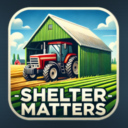

**ShelterMatters** is a mod for Farming Simulator 22 that enhances the importance of sheds and indoor storage by introducing mechanics for vehicle and tool wear and tear based on their location.

---

## Features

- **Damage Accumulation**: Vehicles and tools left outside will accumulate damage over time, even if they're not in use.
- **Dynamic Indoor Detection**: Automatically detects indoor areas for all placeables on the map.
- **Weather Impact**: Weather conditions influence the damage rate of vehicles. More wear occurs during rain, snow, and fog.
- **Configurable Rates**: Server admins can configure damage rates and weather multipliers through commands or configuration files.
- **Savegame Integration**: Configuration is saved per savegame, allowing different damage rates across various saves.

---

## Installation

1. Download the `ShelterMatters.zip` file.
2. Place the file in your Farming Simulator 22 mods folder, typically located at: `Documents/My Games/FarmingSimulator2022/mods`.
3. Launch the game and enable the mod in the "Installed Mods" section.

---

## Usage

### How It Works
- Vehicles and tools left outdoors will slowly accumulate damage, even when idle.
- The mod uses the `indoorAreas` of placeables to detect whether equipment is stored properly.

### Weather Interaction
- Damage and wear accumulation rates are influenced by the current weather. For example:
- **Rain or Snow**: Accelerated damage for vehicles left outside.

---

## Configuration

The mod comes with a default configuration that can be customized. The damage rates and weather multipliers are configurable through a file in your savegame or by using in game commands.

- **Damage Rates**: Controls how much damage is applied to each vehicle type. (This value is a percentage of damage per in-game year)
- **Weather Multipliers**: Controls how the weather affects vehicle damage over time.

Example:

```xml
<config>
TODO
</config>
```

## Commands

In-Game Commands:

The following commands are available for server admins to configure damage rates and weather multipliers directly during gameplay.

### Set Damage Rate for a Vehicle Type

Change the damage rate for a specific vehicle type.

**Command**:

    /sm_setDamageRate <vehicleType> <newRate>

**Example**:

    /sm_setDamageRate tractor 15

This command sets the damage rate for tractors to 15% per in-game year.

### Set Weather Multiplier

Change the weather multiplier for a specific weather type.

**Command**:

    /sm_setWeatherMultiplier <weatherType> <newMultiplier>

**Example**:

    /sm_setWeatherMultiplier RAIN 3.0

This command sets the weather multiplier for rain to 3.0, increasing wear and tear on vehicles by 3 times during rain.

### View Current Damage Rates

View the current damage rates for all vehicle types.

**Command**:

    /sm_getDamageRates

This will list the damage rates for all vehicle types currently in the game.

### View Current Weather Multipliers

View the current weather multipliers.

**Command**:

    /sm_getWeatherMultipliers

This will list the weather multipliers for all weather types currently active in the game.

## Mod Behavior:

### Vehicle Damage:

Vehicles left outdoors will accumulate damage over time, depending on their type and the current weather.
Damage Rate: The rate of damage is configurable for each vehicle type (e.g., tractor, combine harvester, plow, etc.). By default, the rates are set to reflect realistic wear and tear based on each vehicle's purpose.

### Weather Impact:

Weather conditions have a direct impact on vehicle damage rates.
Rain: Vehicles left outdoors in rain will accumulate damage more quickly.
Snow: Snow also increases wear, especially due to moisture and freezing cycles.
Fog: Slightly increases wear due to moisture in the air.
Sunny & Cloudy: These conditions cause minimal or no additional wear.

## Multiplayer Support

The ShelterMatters mod is compatible with multiplayer. The configuration and damage logic are server-side, and changes to damage rates and weather multipliers will affect all players on the server. Only server admins can change these values using the commands.

---

## Troubleshooting

### Common Issues
- **Q: Vehicles are not recognized as "inside."**
- Ensure the shed or placeable has a properly defined indoor area.
- Move the vehicle slightly to ensure it is within the boundaries.

- **Q: I’m not seeing any changes in wear or damage.**
- Verify that the mod is enabled in your save game.
- Check the logs for errors (`log.txt` in the game directory).

---

## Contribution

Feel free to contribute to the development of **ShelterMatters** by reporting bugs, suggesting features, or submitting pull requests on the project’s GitHub page.

---

## License

This mod is distributed under the [MIT License](https://opensource.org/licenses/MIT). Feel free to modify and share it, but please give credit to the original creator.

---

## Credits

- Developed by: depuits
- Special thanks to the Farming Simulator modding community for documentation and support.
