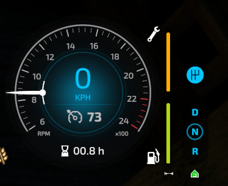
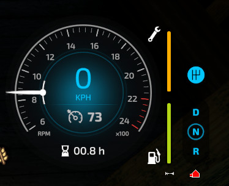
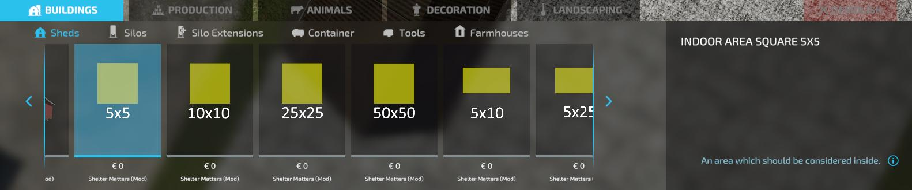

**ShelterMatters** is a mod for Farming Simulator 22 that adds a realistic emphasis on the importance of sheds and indoor storage by introducing mechanics for vehicle and tool wear and tear, as well as bale deterioration, based on their exposure to the elements for a more immersive farming experience.

In the base game, vehicle damage only occurs when equipment is in use. ShelterMatters changes this by introducing passive wear over time when vehicles are left outside. Each vehicle type has a specific damage rate, with a baseline of 10% per year. More sensitive machinery like harvesters experiences higher wear at 15% per year, while trailers are more resilient experiencing just 5% per year, ensuring a diverse and dynamic impact on farm operations. (These rates are if the vehicle would stay outside for a full year without any use, and clear weather).

Weather conditions also play a crucial role in the wear process. Vehicles exposed to rain can experience up to 5x increased wear, while snow results in 2x increased wear, and even fog has a moderate impact with a 1.5x multiplier. Storing equipment indoors mitigates these effects, making sheds an essential part of farm management.

Gone are the days of leaving your bales in the field without consequence! In addition to vehicles and tools, bales are now affected by exposure to the weather. Bales stored outdoors will deteriorate over time based on the current weather conditions, leading to potential loss of valuable feed and materials. Storing bales in sheds or covered areas prevents decay entirely, encouraging you to invest in proper storage solutions to avoid financial losses.

With ShelterMatters, sheds and storage buildings become a necessary investment, offering real benefits by protecting your valuable equipment from accelerated wear and reducing maintenance costs over time. This mod adds a strategic layer to the game, making strategic storage planning an important aspect of efficient farm management.

---

## Features

- **Damage Accumulation**: Vehicles and tools left outside will accumulate damage over time, even if they're not in use.
- **Bale Decay Mechanics**: Bales deteriorate over time when exposed to adverse weather conditions, encouraging proper storage practices. ([can be disabled](#disabling-bale-decay))
- **Dynamic Indoor Detection**: Automatically detects indoor areas for all placeables on the map.
- **Weather Impact**: Weather conditions influence the damage rate of vehicles. More wear occurs during rain, snow, and fog.
- **Configurable Rates**: Server admins can configure damage rates and weather multipliers through commands or configuration files.
- **Savegame Integration**: Configuration is saved per savegame, allowing different damage rates across various saves.
- **Custom Indoor Areas**: Placeable indoor area markers (found under Buildings → Sheds) allow you to define indoor spaces for buildings without built-in indoor detection.

---

## Installation

1. Download the `FS22_ShelterMatters.zip` file.
2. Place the file in your Farming Simulator 22 mods folder, typically located at: `Documents/My Games/FarmingSimulator2022/mods`.
3. Launch the game and enable the mod in the "Installed Mods" section.

> **Tip**: To ensure proper indoor detection, especially on custom maps, use the included **Indoor Area placeables** (*Buildings → Sheds*) to define sheltered zones.

### Uninstalling

If you decide that the ShelterMatters mod does not fit your playstyle, you can easily remove it without affecting your savegame. Follow these simple steps to uninstall the mod safely:

1. Sell or remove any placed Indoor Area placeables before uninstalling to avoid lingering objects in your savegame.
2. Disable the mod in your savegame from the "Installed Mods" section in the main menu.
3. (Optional) Delete the FS22_ShelterMatters.zip file from your mods folder, typically located at: `Documents/My Games/FarmingSimulator2022/mods`.

That's it! Your savegame will continue to work as normal without the mod.

---

## Usage

### How It Works
- Vehicles and tools left outdoors will slowly accumulate damage, even when idle.
- The mod uses the `indoorAreas` of placeables to detect whether equipment is stored properly.
- If a building lacks defined indoor areas (common in custom maps), you can use the Indoor Area placeables included in the mod to manually define them.

### Weather Interaction
- Damage and wear accumulation rates are influenced by the current weather. For example:
- **Rain or Snow**: Accelerated damage for vehicles left outside.

### Vehicle Shelter Indication

ShelterMatters provides an on-screen indication showing whether the **currently selected vehicle or tool** is inside or outside a shelter. This feature helps players manage their equipment by highlighting when vehicles are protected from increased damage rates due to being exposed outdoors.

- When inside a vehicle, an on-screen indicator displays the shelter status:
  - **Inside a Shelter**: Confirms the selected vehicle or tool is within a shelter, sheltering it from outside damage.
  - **Outside a Shelter**: Warns that the selected vehicle or tool is exposed, making it more susceptible to damage based on the current weather conditions.

- The indication applies specifically to the **currently selected vehicle or tool**, allowing players to monitor the status of individual implements and attachments.


Below is an example of the shelter indication for a vehicle inside and outside a shed.

**Inside a Shelter**  


**Outside a Shelter**  


This icon can be disabled using the [`smToggleShelterStatusIcon` command](#toggle-icon-status) or by editing the save file.

#### Additional Notes

- The shelter status updates dynamically as the vehicle or tool moves in or out of a shelter.
- For attached implements, the shelter status is determined by the position of the implement relative to the shelter's boundaries.

This feature simplifies equipment management by providing real-time feedback, ensuring vehicles and tools are protected from unnecessary damage whenever possible.

---

## Configuration

The mod comes with a default configuration that can be customized. The damage rates and weather multipliers are configurable through a file in your savegame or by using in game commands.

- **Hide Shelter Status Icon**: Determines wheiter the Vehicle Shelter Indication is displayed.
- **Damage Rates**: Controls how much damage is applied to each vehicle type. (This value is a percentage of damage per in-game year)
- **Weather Multipliers**: Controls how the weather affects vehicle damage over time.
- **Bale Weather Decay**: Controls how much the weather affects bale over time. (This value is liters lost per in-game hour)

Example:

```xml
<?xml version="1.0" encoding="utf-8" standalone="no"?>
<ShelterMatters>
    <hideShelterStatusIcon>false</hideShelterStatusIcon>
    <damageRates>
        <rate type="seeder" rate="12.000000"/>
        <rate type="manureSpreader" rate="15.000000"/>
        <rate type="balerWrapper" rate="10.000000"/>
        <rate type="combineHarvester" rate="20.000000"/>
        <rate type="fertilizerSpreader" rate="10.000000"/>
        <rate type="slurrySpreader" rate="15.000000"/>
        <rate type="seedDrill" rate="12.000000"/>
        <rate type="trailer" rate="5.000000"/>
        <rate type="harvester" rate="20.000000"/>
        <rate type="mower" rate="10.000000"/>
        <rate type="plow" rate="15.000000"/>
        <rate type="windrower" rate="10.000000"/>
        <rate type="sprayer" rate="12.000000"/>
        <rate type="stonePicker" rate="10.000000"/>
        <rate type="vehicle" rate="10.000000"/>
        <rate type="transport" rate="5.000000"/>
        <rate type="default" rate="10.000000"/>
        <rate type="cultivator" rate="10.000000"/>
        <rate type="car" rate="10.000000"/>
        <rate type="baler" rate="15.000000"/>
        <rate type="tractor" rate="10.000000"/>
    </damageRates>
    <weatherMultipliers>
        <multiplier type="rain" multiplier="5.000000"/>
        <multiplier type="snow" multiplier="2.000000"/>
        <multiplier type="fog" multiplier="1.500000"/>
        <multiplier type="cloudy" multiplier="1.000000"/>
        <multiplier type="sunny" multiplier="1.000000"/>
    </weatherMultipliers>
    <baleWeatherDecay>
        <rate type="rain" rate="3000"/>
        <rate type="snow" rate="2000"/>
        <rate type="fog" rate="1000"/>
        <rate type="default" rate="0"/>
    </baleWeatherDecay>
</ShelterMatters>
```

### Disabling Bale Decay

You can disable the decay of bales by setting all the `baleWeatherDecay` rates to `0`. This will also completly skip the indoors check for bales.

## Commands

The following commands can be used by server admins to configure damage rates and weather multipliers, as well as to debug vehicle and weather-related details. These commands must be entered through the developer console, which can be accessed by enabling the console in the game's settings.

### Set Damage Rate

- **Command**: `smSetDamageRate <typeName> <newRate>`
- **Description**: Changes the damage rate for a specific vehicle type. Adjust how much damage a particular vehicle type accumulates over time.
- **Arguments**:
  - `<typeName>`: The type of vehicle (e.g., `tractor`, `harvester`).
  - `<newRate>`: The new damage rate as a decimal (e.g., `2` for 2% per game year).
- **Example**: 
  - `smSetDamageRate tractor 5`
  - This sets the damage rate for tractors to 5% per game year.

---

### Set Weather Multiplier
- **Command**: `smSetWeatherMultiplier <weatherType> <newMultiplier>`
- **Description**: Updates the wear multiplier for a specific weather condition. Adjust how different weather conditions affect vehicle damage rates.
- **Arguments**:
    - `<weatherType>`: The weather condition (e.g., `sunny`, `rain`, `snow`).
    - `<newMultiplier>`: The new multiplier as a decimal (e.g., `2.0` for double wear during this weather).
- **Example**:
    - `smSetWeatherMultiplier rain 4.0`
    - This increases wear during rain to four times the normal rate.

---

### Set Bale Decay Rate

- **Command**: `smSetBaleWeatherDecay <weatherType> <newRate>`
- **Description**: Adjusts the rate at which bales deteriorate based on weather conditions.
- **Arguments**:
    - `<weatherType>`: The weather condition (e.g., `sunny`, `rain`, `snow`).
    - `<newRate>`: The new decay rate in liters per in-game hour.
- **Example**:
    - `smSetBaleWeatherDecay rain 3000`
    - This sets the bale decay rate to 3000 liters per hour during rain.

---

### List Damage Rates
- **Command**: `smListDamageRates`
- **Description**: Lists the current damage rates for all vehicle types.
- **Example Output**:
```
=== Current Damage Rates ===
Type: seeder, Rate: 12.00
Type: manureSpreader, Rate: 15.00
Type: trailer, Rate: 5.00
Type: harvester, Rate: 20.00
Type: tractor, Rate: 10.00
=== End of List ===
```

---

### List Weather Multipliers
- **Command**: `smListWeatherMultipliers`
- **Description**: Lists the current weather multipliers, showing how different weather conditions impact vehicle wear.
- **Example Output**:
```
=== Current Weather Multipliers ===
Weather: sunny, Multiplier: 1.00
Weather: cloudy, Multiplier: 1.00
Weather: fog, Multiplier: 1.50
Weather: snow, Multiplier: 2.00
Weather: rain, Multiplier: 5.00
=== End of List ===
```

---

### List Bale Decay Rates
- **Command**: smListBaleWeatherDecay
- **Description**: Lists the current bale deterioration rates for each weather type.
- **Example Output**:
```
=== Current Bale Decay by Weather ===
Weather: default, Decay Rate: 0 L/h
Weather: fog, Decay Rate: 1500 L/h
Weather: snow, Decay Rate: 2000 L/h
Weather: rain, Decay Rate: 3000 L/h
=== End of List ===
```

---

### Vehicle Details
- **Command**: `smVehicleDetails`
- **Description**: Displays detailed information about the vehicle currently being used.
- **Example Output**:
```
Entity type: tractor
Entity name: JCB Fastrac 8330
dmg: 0.056016001850367
active: true
operating: false
operatingtime: 2806333.984375
damageRate: 10
Attached implements:
Entity type: trailer
Entity name: KRONE GX 520
dmg: 0.036605998873711
active: true
operating: false
operatingtime: 364191.00952148
damageRate: 5
```

---

### Current Weather
- **Command**: `smCurrentWeather`
- **Description**: Displays the current weather conditions and their associated multiplier.
- **Example Output**: `Weather: rain, applying multiplier: 5.00`

---

### Toggle icon status
- **Command**: `smToggleShelterStatusIcon`
- **Description**: Toggle the visibility of the shelter status icon. This is saved in the savegame and for all users.


## Mod Behavior:

### Vehicle Damage:

Vehicles left outdoors will accumulate damage over time, depending on their type and the current weather.
Damage Rate: The rate of damage is configurable for each vehicle type (e.g., tractor, combine harvester, plow, etc.). By default, the rates are set to reflect realistic wear and tear based on each vehicle's purpose.

### Weather Impact:

Weather conditions have a direct impact on vehicle damage rates.

**Rain**: Vehicles left outdoors in rain will accumulate damage more quickly.
**Snow**: Snow also increases wear, especially due to moisture and freezing cycles.
**Fog**: Slightly increases wear due to moisture in the air.
**Sunny & Cloudy**: These conditions cause minimal or no additional wear.

## Multiplayer Support

The ShelterMatters mod is compatible with multiplayer. The configuration and damage logic are server-side, and changes to damage rates and weather multipliers will affect all players on the server. Only server admins can change these values using the commands.

---

## Troubleshooting

### Common Issues
**Q: Vehicles are not recognized as "inside".**
- Ensure the shed or placeable has a properly defined indoor area.
- Move the vehicle slightly to ensure it is within the boundaries.

**Q: Buildings do not provide indoor detection.**
- Some placeables or map buildings may **lack defined indoor areas**, particularly static buildings on custom maps (**non-selectable in construction mode**).
- **➡️ Solution**:
    - Use the **Indoor Area placeables** included in this mod (**Buildings → Sheds**) to manually define indoor zones.
    - This ensures vehicles, tools, bales, and pallets stored within these areas are correctly recognized as "inside."



**Q: I’m not seeing any changes in wear or damage.**
- Verify that the mod is enabled in your save game.
- Check the logs for errors (`log.txt` in the game directory).

---

## Contribution

Feel free to contribute to the development of **ShelterMatters** by reporting bugs, suggesting features, or submitting pull requests on the project’s GitHub page.

---

## License

This mod is distributed under the [MIT License](https://opensource.org/licenses/MIT). Feel free to modify and share it, but please give credit to the original creator.

---

## Credits

- Developed by: depuits
- Special thanks to the Farming Simulator modding community for documentation and support.
