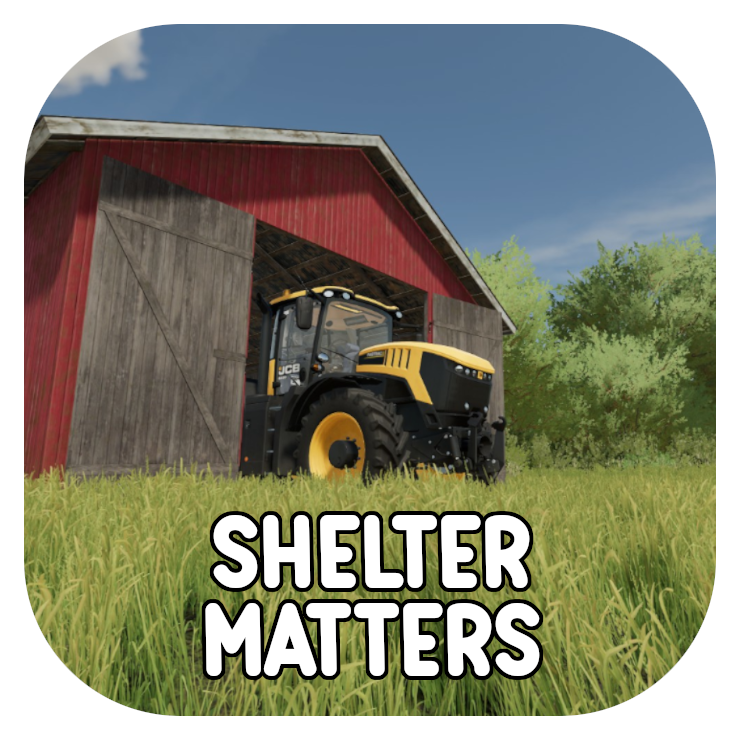

**ShelterMatters** enhances the importance of sheds and indoor storage in Farming Simulator 22 by introducing realistic wear and decay mechanics. Vehicles, tools, and stored goods deteriorate faster when exposed to the elements, making proper storage essential. Products now have a best-before period, after which they begin to degrade. Factors like moisture and temperature further influence their lifespan, requiring players to manage storage conditions carefully. Proper shelter is no longer just optional - it is key to efficiently preserving your equipment and produce, adding to a more immersive farming experience.

---

## Features

- **Vehicle & Tool Degradation**: Outdoor exposure causes gradual damage to unused vehicles and equipment
- **Perishable Goods System**:
  - Best-by dates
  - Weather wetness (rain/snow causes moisture damage)
  - Temperature effects (heat spoilage, freezing damage)
- **Smart Storage Detection**:
  - Automatic recognition of valid indoor spaces
  - Custom zone markers for non-standard structures (found in Buildings → Sheds)
- **Customizable Settings**:
  - Adjustable decay rates via config files
  - Savegame-specific configurations

---

## Installation

1. Download the `FS22_ShelterMatters.zip` file.
2. Place the file in your Farming Simulator 22 mods folder, typically located at: `Documents/My Games/FarmingSimulator2022/mods`.
3. Launch the game and enable the mod in the "Installed Mods" section.

> **Tip**: To ensure proper indoor detection, especially on custom maps, use the included **Indoor Area placeables** (*Buildings → Sheds*) to define sheltered zones.

### Uninstalling

If you decide that the ShelterMatters mod does not fit your playstyle, you can easily remove it without affecting your savegame. Follow these simple steps to uninstall the mod safely:

1. Sell or remove any placed Indoor Area placeables before uninstalling to avoid lingering objects in your savegame.
2. Disable the mod in your savegame from the "Installed Mods" section in the main menu.
3. (Optional) Delete the FS22_ShelterMatters.zip file from your mods folder, typically located at: `Documents/My Games/FarmingSimulator2022/mods`.

That's it! Your savegame will continue to work as normal without the mod.

---

## Mod Behavior

### How It Works
- Vehicles and tools left outdoors will slowly accumulate damage, even when idle.
- The mod uses the `indoorAreas` of placeables to detect whether equipment is stored properly.
- If a building lacks defined indoor areas (common in custom maps), you can use the Indoor Area placeables included in the mod to manually define them.

### Vehicle Damage

Vehicles left outdoors will accumulate damage over time, depending on their type and the current weather.
Damage Rate: The rate of damage is configurable for each vehicle type (e.g., tractor, combine harvester, plow, etc.). By default, the rates are set to reflect realistic wear and tear based on each vehicle's purpose.

### Weather Impact

Weather conditions have a direct impact on vehicle damage rates.

**Rain**: Vehicles left outdoors in rain will accumulate damage more quickly.
**Snow**: Snow also increases wear, especially due to moisture and freezing cycles.
**Fog**: Slightly increases wear due to moisture in the air.
**Sunny & Cloudy**: These conditions cause minimal or no additional wear.

### Weather Interaction
- Damage and wear accumulation rates are influenced by the current weather. For example:
- **Rain or Snow**: Accelerated damage for vehicles left outside.

### Vehicle Shelter Indication

ShelterMatters provides an on-screen indication showing whether the **currently selected vehicle or tool** is inside or outside a shelter. This feature helps players manage their equipment by highlighting when vehicles are protected from increased damage rates due to being exposed outdoors.

- When inside a vehicle, an on-screen indicator displays the shelter status:
  - **Inside a Shelter**: Confirms the selected vehicle or tool is within a shelter, sheltering it from outside damage.
  - **Outside a Shelter**: Warns that the selected vehicle or tool is exposed, making it more susceptible to damage based on the current weather conditions.

- The indication applies specifically to the **currently selected vehicle or tool**, allowing players to monitor the status of individual implements and attachments.


Below is an example of the shelter indication for a vehicle inside and outside a shed.

**Inside a Shelter**  


**Outside a Shelter**  


This icon can be disabled using the [`smToggleShelterStatusIcon` command](#toggle-icon-status) or by editing the save file.

---

## Configuration

The mod comes with a default configuration that can be customized. All parameters are configurable through a file in your savegame or by using in game commands.

- **Hide Shelter Status Icon**: Determines wheiter the Vehicle Shelter Indication is displayed.
- **Pallet Spawn Protection**: Time in hours for spawned pallets to have decay and wetness protection.
- **Damage Rates**: Controls how much damage is applied to each vehicle type. (This value is a percentage of damage per in-game year)
- **Weather Multipliers**: Controls how the weather affects vehicle damage over time.
- **Weather Wetness Rates**: Controls how fast products get wet in a specific weather condition. (expressed in %/min)
- **Decay Properties**:
    - **wetnessImpact**: Multiplier on weatherWetnessRates to make the weather impact more or less
    - **wetnessDecay**: Amount of decay when fully wet (liters/month)
    - **bestBeforePeriod**: Shelf life before decay starts (months)
    - **bestBeforeDecay**: Decays after best-before period ended (liters/month)
    - **maxTemperature**: Maximum temperature the product stays good in (celcius)
    - **maxTemperatureDecay**: Decay when product stays above the maximum temperature (liters/hour)
    - **minTemperature**: Minimum temperature the product stays good in (celcius)
    - **minTemperatureDecay**: Decay when product stays under the minimum temperature (liters/hour)
- **weatherAffectedSpecs**: Vehicle specialisations on which the weather *has* impact on the products. If a vehicle has a single one of these then it will be affected by weather conditions.
- **weatherExcludedSpecs**: Vehicle specialisations on which the weather *has no* impact on the products. If a vehicle has a single one of these then it will not be affected by weather conditions.
- **weatherExcludedTypes**: Vehicle type in which the weather has no impact on the products.

### Example config

```xml
<?xml version="1.0" encoding="utf-8" standalone="no"?>
<ShelterMatters>
    <hideShelterStatusIcon>false</hideShelterStatusIcon>
    <palletSpawnProtection>24</palletSpawnProtection>
    <damageRates>
        <rate type="default" rate="10.000000"/>
        <rate type="seeder" rate="12.000000"/>
        <rate type="combineHarvester" rate="20.000000"/>
        <rate type="baler" rate="15.000000"/>
        <rate type="tractor" rate="10.000000"/>
        ...
    </damageRates>
    <weatherMultipliers>
        <multiplier type="rain" multiplier="5.000000"/>
        <multiplier type="snow" multiplier="2.000000"/>
        <multiplier type="fog" multiplier="1.500000"/>
        <multiplier type="cloudy" multiplier="1.000000"/>
        <multiplier type="sunny" multiplier="1.000000"/>
    </weatherMultipliers>
    <weatherWetnessRates>
        <rate type="default" rate="0.000000"/>
        <rate type="fog" rate="0.500000"/>
        <rate type="rain" rate="2.000000"/>
        <rate type="snow" rate="1.000000"/>
    </weatherWetnessRates>
    <decayProperties>
        <property type="WHEAT" wetnessImpact="1.000000" wetnessDecay="2000.000000" bestBeforePeriod="24" bestBeforeDecay="500.000000"/>
        <property type="BARLEY" wetnessImpact="1.000000" wetnessDecay="2000.000000" bestBeforePeriod="24" bestBeforeDecay="500.000000"/>
        <property type="PARSNIP" wetnessImpact="1.200000" wetnessDecay="3000.000000" bestBeforePeriod="9" bestBeforeDecay="2500.000000" maxTemperature="8" maxTemperatureDecay="15.000000" minTemperature="-2" minTemperatureDecay="10.000000"/>
        ...
    </decayProperties>
    <weatherAffectedSpecs>
        <value name="Shovel"/>
        <value name="Trailer"/>
    </weatherAffectedSpecs>
    <weatherExcludedSpecs>
        <value name="WaterTrailer"/>
    </weatherExcludedSpecs>
    <weatherExcludedTypes>
    </weatherExcludedTypes>
</ShelterMatters>
```

## Commands

The following commands can be usefull for quick ingame changes and debug purposes. These commands must be entered through the developer console, which can be accessed by enabling the console in the game's settings.

---

### Current Weather
- **Command**: `smCurrentWeather`
- **Description**: Displays the current weather conditions and their associated multiplier.
- **Example Output**: `Weather: rain, applying multiplier: 5.00`

---

### Toggle icon status
- **Command**: `smToggleShelterStatusIcon`
- **Description**: Toggle the visibility of the shelter status icon. This is saved in the savegame and for all users.

---

## Multiplayer Support

The ShelterMatters mod is compatible with multiplayer. The configuration and damage logic are server-side, and changes to damage rates and weather multipliers will affect all players on the server. Only server admins can change these values using the commands.

---

## Troubleshooting

### Common Issues
**Q: Vehicles are not recognized as "inside".**
- Ensure the shed or placeable has a properly defined indoor area.
- Move the vehicle slightly to ensure it is within the boundaries.

**Q: Buildings do not provide indoor detection.**
- Some placeables or map buildings may **lack defined indoor areas**, particularly static buildings on custom maps (**non-selectable in construction mode**).
- **➡️ Solution**:
    - Use the **Indoor Area placeables** included in this mod (**Buildings → Sheds**) to manually define indoor zones.
    - This ensures vehicles, tools, bales, and pallets stored within these areas are correctly recognized as "inside."


**Q: I’m not seeing any changes in wear or damage.**
- Verify that the mod is enabled in your save game.
- Check the logs for errors (`log.txt` in the game directory).

---

## Contribution

Feel free to contribute to the development of **ShelterMatters** by reporting bugs, suggesting features, or submitting pull requests on the project’s GitHub page.

---

## License

This mod is distributed under the [MIT License](https://opensource.org/licenses/MIT). Feel free to modify and share it, but please give credit to the original creator.

---

## Credits

- Developed by: depuits
- Special thanks to the Farming Simulator modding community for documentation and support.
